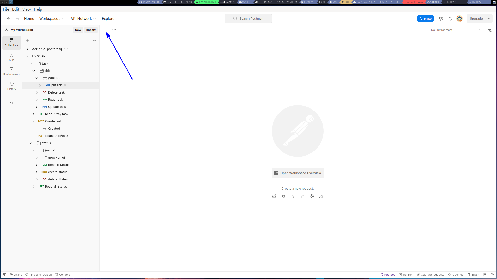
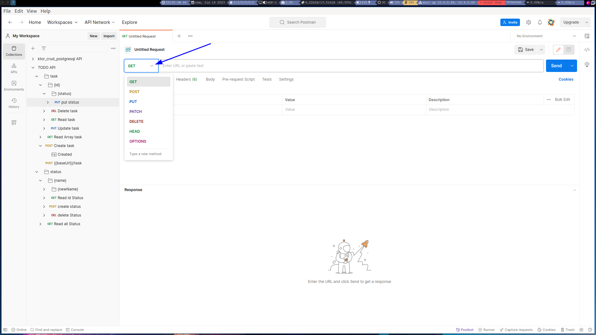
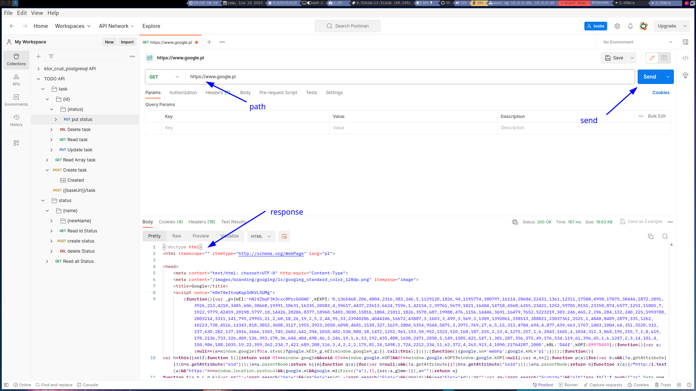
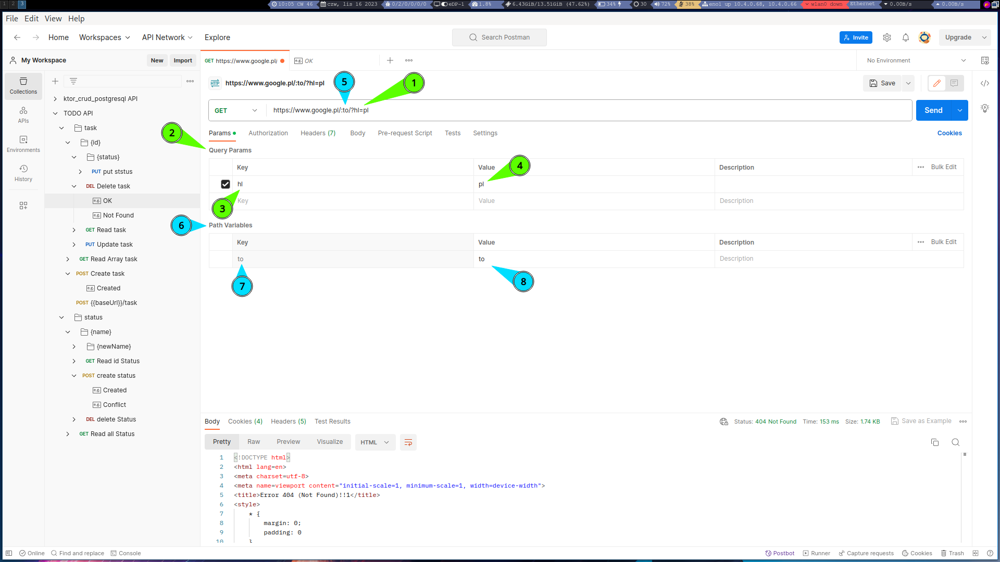
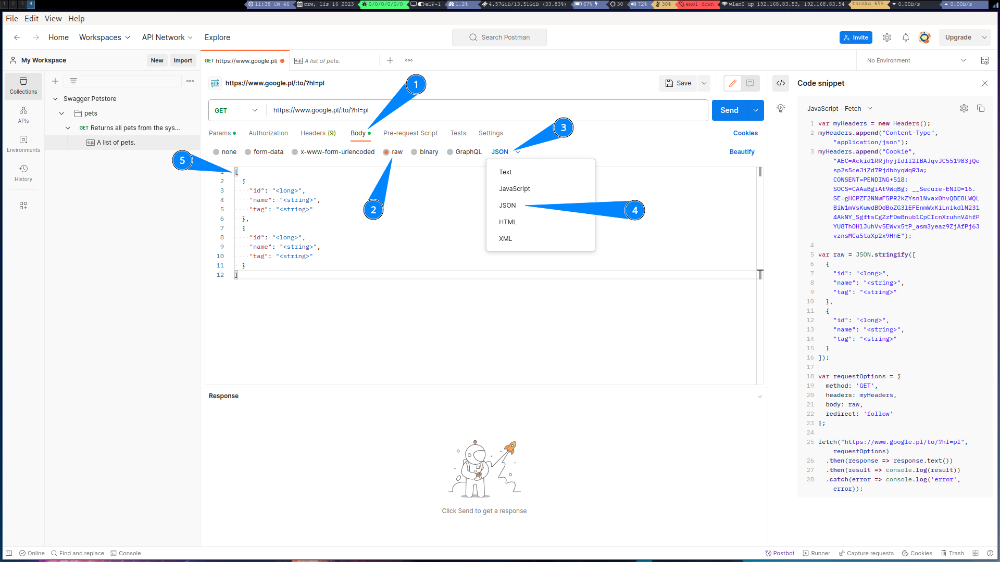

# Add Http Request 

### add

### choose of http method

### add path and send

### add Params

1) Query Params In The Path
2) Query Params table
3) Query Params key
4) Query Params value
5) Path Variables In The Path
6) Path Variables table
7) Path Variables key
8) Path Variables value

### Json body

