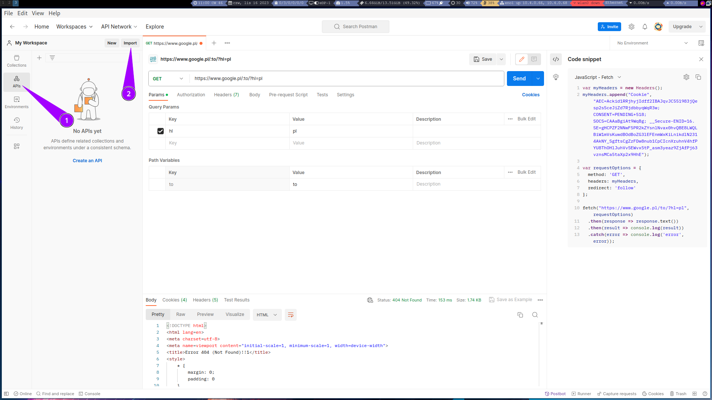
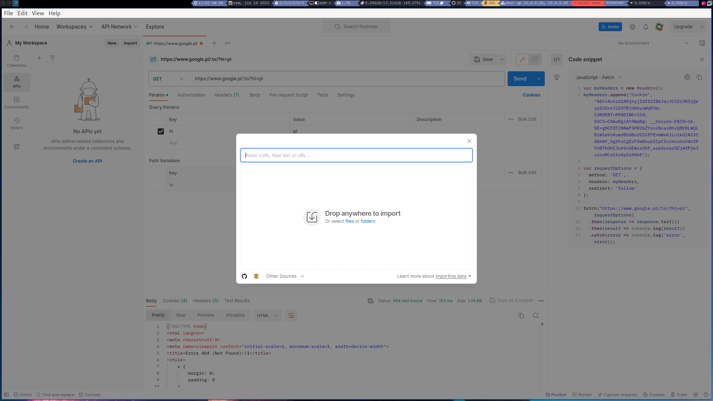
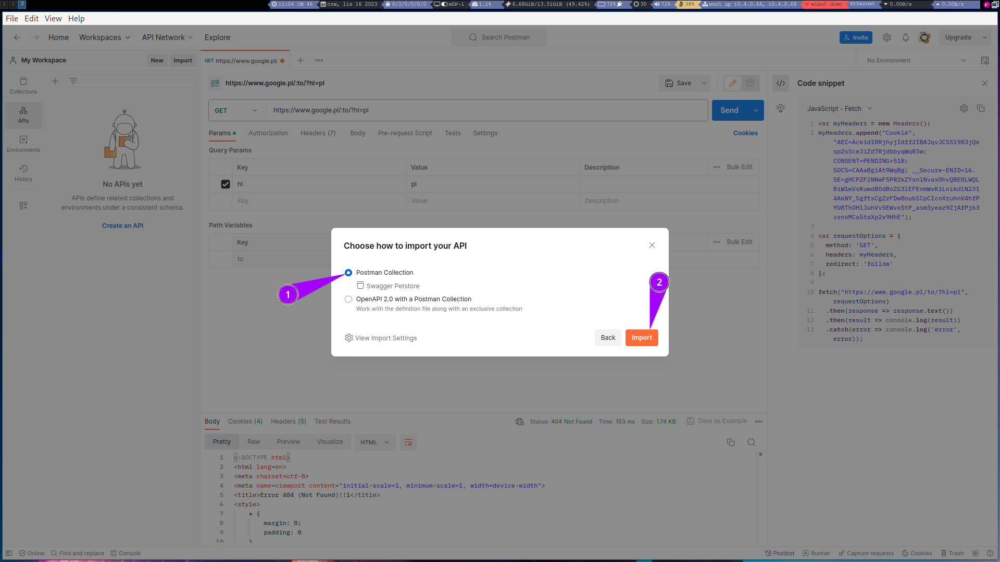
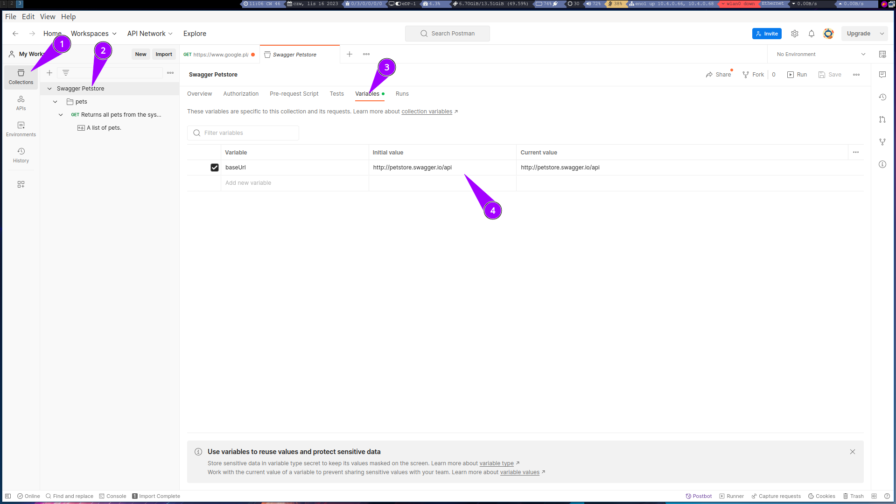
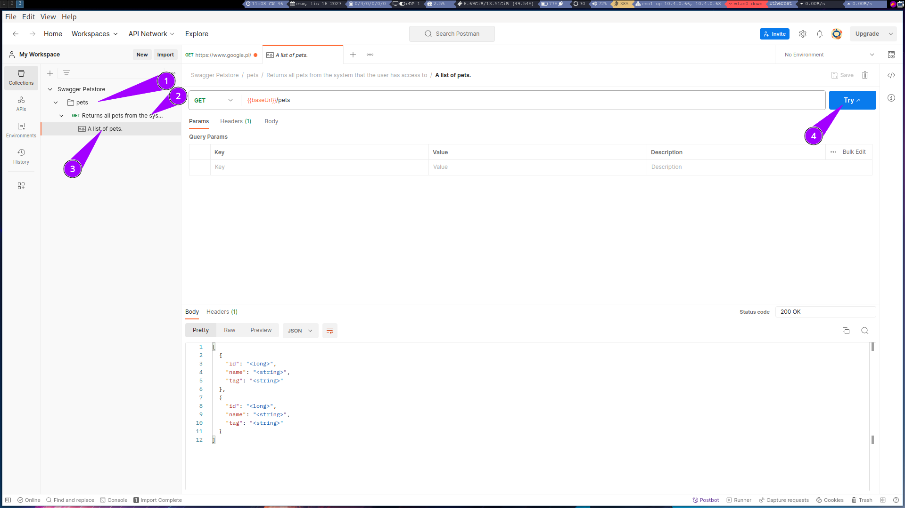

# Add Http Request

### menu

[](images/openAPI/menu.png)

### paste raw text

[OpenAPI json example](https://github.com/OAI/OpenAPI-Specification/blob/main/examples/v2.0/json/petstore-minimal.json)
```yaml

{
  "swagger": "2.0",
  "info": {
    "version": "1.0.0",
    "title": "Swagger Petstore",
    "description": "A sample API that uses a petstore as an example to demonstrate features in the swagger-2.0 specification",
    "termsOfService": "http://swagger.io/terms/",
    "contact": {
      "name": "Swagger API Team"
    },
    "license": {
      "name": "MIT"
    }
  },
  "host": "petstore.swagger.io",
  "basePath": "/api",
  "schemes": [
    "http"
  ],
  "consumes": [
    "application/json"
  ],
  "produces": [
    "application/json"
  ],
  "paths": {
    "/pets": {
      "get": {
        "description": "Returns all pets from the system that the user has access to",
        "produces": [
          "application/json"
        ],
        "responses": {
          "200": {
            "description": "A list of pets.",
            "schema": {
              "type": "array",
              "items": {
                "$ref": "#/definitions/Pet"
              }
            }
          }
        }
      }
    }
  },
  "definitions": {
    "Pet": {
      "type": "object",
      "required": [
        "id",
        "name"
      ],
      "properties": {
        "id": {
          "type": "integer",
          "format": "int64"
        },
        "name": {
          "type": "string"
        },
        "tag": {
          "type": "string"
        }
      }
    }
  }
}

```

[](images/openAPI/empty.png)

### menu2

[](images/openAPI/menu2.png)

### set baseURL

[](images/openAPI/baseURL.png)

### try 

[](images/openAPI/try.png)


